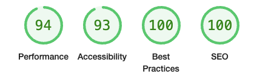
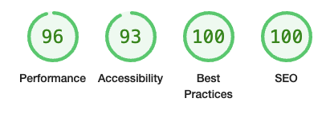
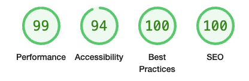
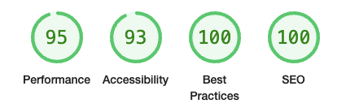
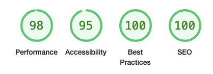
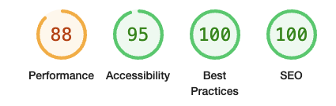

=======================================

# ProjectTracker

## Introduction

ProjectTracker is a web application designed to help users manage and track their projects efficiently. With a sleek, modern interface and user-friendly features, ProjectTracker aims to streamline project management tasks for individuals and teams.

## Key Features

- **User Authentication**: Secure sign-in system to protect user data and projects.
- **Project Management**: Create, update, and track multiple projects.
- **Responsive Design**: Fully responsive interface that works on desktop and mobile devices.
- **Custom Styling**: Unique color scheme and design elements for a distinctive user experience.

___


## Technical Stack

- **Backend**: Built with Django, a Python framework.
- **Frontend**: HTML, CSS, Javascript, leveraging Bootstrap Design Libraries
- **Database**: POSTGRESQL hosted on SUPABASE

## Getting Started

To begin using ProjectTracker, simply navigate to the homepage and create an account. Once logged in, you'll have access to all the project management tools at your fingertips.


## Wireframes
### Design Wireframes:
* Create wireframes for the main pages of the application (registration, login, dashboard, project management, task management) to guide the frontend development.

## Models
1. **User:** Stores user information and authentication details.
2. **Profile:** Stores additional user information like bio, profile picture.
3. **Project:** Stores details of projects, including title, description, state, and timestamps.
4. **Task:** Stores details of tasks, including title, description, due date, status, and associated project.
5. **Comment:** (Optional) Stores comments on projects or tasks.

## Tech Stack
- **Backend:** Django for API development and user authentication.
- **Frontend:** Plain JavaScript and Bootstrap for the user interface.

## Implementation Outline

### Backend (Django)
1. **Set Up Django Project:**
   - Initialize a new Django project and configure the settings, including the connection to the Supabase database.
2. **Create User Model and Authentication Endpoints:**
   - Implement the user model and endpoints for user registration, login, and profile management using Django REST Framework.
3. **Develop Project Model and Endpoints:**
   - Create the project model with fields for title, description, and state. Implement CRUD endpoints for managing projects.
4. **Develop Task Model and Endpoints:**
   - Create the task model with fields for title, description, due date, status, and associated project. Implement CRUD endpoints for managing tasks.
5. **Develop Comment Model and Endpoints (Optional):**
   - Create a comment model for adding comments to projects or tasks. Implement CRUD endpoints for managing comments.
6. **Test Backend with Postman:**
   - Use Postman to test all API endpoints for user, project, task, and comment management to ensure they function correctly.

### Frontend (Plain JS + Bootstrap)
1. **Set Up Frontend Project:**
   - Initialize a new frontend project using plain JavaScript and configure Bootstrap for styling.
2. **Develop Registration and Login Pages:**
    - Create the registration and login pages with forms for user input and connect them to the backend authentication endpoints.
3. **Develop Dashboard Page:**
    - Implement the dashboard page to display the user's projects, with options to add, edit, delete, and view tasks.
4. **Develop Project Management:**
    - Create forms and functionality to add, edit, and delete projects, and update the project state.
5. **Develop Task Management:**
    - Create forms and functionality to add, edit, and delete tasks within projects.
6. **Implement State Management:**
    - Ensure that projects can transition between draft, ongoing, completed, and cancelled states through the frontend interface.
7. **Integrate Comments (Optional):**
    - Add functionality to view, add, edit, and delete comments on projects and tasks.

### Database and Hosting
1. **Configure Supabase Database:**
    - Set up the Supabase database, create necessary tables and configure Django to connect to it.
2. **Deploy Backend to Heroku:**
    - Deploy the Django backend to Heroku, ensuring that all environment variables and configurations are set up correctly.
3. **Deploy Frontend to Heroku:**
    - Deploy the frontend to Heroku and configure it to communicate with the backend.
4. **Set Up Content Delivery Network (CDN) (Optional):**
    - Consider using a CDN like Cloudinary for storing and serving images to ensure faster load times and handle Heroku’s sleep mode limitations.

### Testing and Optimization
1. **End-to-End Testing:**
    - Perform end-to-end testing of the entire application to ensure all components work together seamlessly.
2. **Optimize Performance:**
    - Optimize the performance of the frontend and backend, ensuring quick load times and efficient API calls.
3. **Prepare for Launch:**
    - Finalize all features, ensure all documentation is complete, and prepare the application for launch.

### User Stories

## Site Users
* As a new user, I'll be informed about the benefits of using the webpage/webapp before signing up.
* As a new user, I want to get a confirmation e-Mail, with a link for activating my account.
* As a user, I can register so that I can create, edit, and delete my projects.
* As a user, I can choose a due date for my project to set a deadline.
* As a user, I can choose a creation date for my project, which is default set to "today" to keep track of when I started the project.
* As a user, I can view all of my projects on a dashboard to manage them efficiently.
* As a user, I have access to my profile and can edit or add data to keep my information up to date.
* As a user, I can mark my project to be public to share it with others.
* (Optional) As a potential user, I can view how many users/requests the website has so that I know if it's a real deal before signing up.
* (Optional) As a potential user, I can view publicly made project histories to understand the types of projects managed on the platform.
* (Optional) As a registered user, I can add comments to a public project to provide feedback or suggestions.
## Mobile Users
* As a mobile user, I have a different view that helps me to scroll through my existing projects easily and efficiently.
* As a mobile user, I can access all the features available to desktop users but in a mobile-optimized layout for a better user experience.
## Admin
* As an administrator, I can access the admin panel so that I can monitor the page and existing users to ensure everything is running smoothly.
* As an administrator, I can manage user accounts, including the ability to deactivate or delete accounts if necessary.
* As an administrator, I can oversee all projects, including the ability to edit or delete any project to maintain the quality and appropriateness of content on the platform.
* As an administrator, I can view and manage comments on public projects to ensure they adhere to community guidelines.

## Features

### Future Features (out of scope)

- Enhance UX, leverage full capabilities of Django's message framework for a seamless User Experience
- Comments Section, enable commenting on public projects. Generating insight for project creators.
- More colors do distinguish more clearly the state of a project, is it a Draft? or maybe it's already Finished?

## Design

Rather simple but clear design patterns.

### **Fonts**

Montserrat <br>
* A sans-serif font used for headings and emphasis. Applied with weights 600 (semi-bold) and 700 (bold).

Roboto  <br>
* A clean, modern sans-serif font used for body text and general content. Applied with weights 300 (light), 400 (regular), and 700 (bold).


### **Color Palette**

| Used for Background gradient                      | Highlight buttons on hover                          | Theme color for footer                              | Highlight correct answer                                     | Highlight incorrect answer                                   |
| ------------------------------------------------- | --------------------------------------------------- | --------------------------------------------------- | ------------------------------------------------------------ | ------------------------------------------------------------ |
|  |  |  |  |  |

## Technologies, Libraries & Sources

## Deployment

This project is a Django application. The required dependencies are listed in `requirements.txt`. All sensitive information and settings are stored in an `env.py` file for local development, and as config vars for production deployments like Heroku.

### Environment Config
| Syntax                | Description                                                                                |
| --------------------- | ------------------------------------------------------------------------------------------ |
| SECRET_KEY            | Generated by Django Framework                                                              |
| SUPABASE_URL          | Lookep up inside the Supabase web UI                                                       |
| SUPABASE_KEY          | Lookep up inside the Supabase web UI                                                       |
| CLOUDINARY_CLOUD_NAME | Lookep up inside the Cloudinary web UI                                                     |
| CLOUDINARY_API_KEY    | Lookep up inside the Cloudinary web UI                                                     |
| CLOUDINARY_API_SECRET | Lookep up inside the Cloudinary web UI                                                     |
| DB_NAME               | postgres                                                                                   |
| DB_USER               | Lookep up inside the Supabase web UI                                                       |
| DB_PASSWORD           | Lookep up inside the Supabase web UI                                                       |
| DB_HOST               | Lookep up inside the Supabase web UI                                                       |
| DB_PORT               | Lookep up inside the Supabase web UI                                                       |
| SUPERADMIN            | Optional, helps not to forget it                                                           |
| SUPERADMIN_PASSWORD   | Optional, helps not to forget it                                                           |
| EMAIL_ADDRESS         | user provided email, e.g. a free gmail address                                             |
| EMAIL_PASSWORD        | user provided app password (this is not the authentication password for you email address) |
| ALLOWED_HOSTS         | 127.0.0.1,localhost,.herokuapp.com (add further hosts if needed, e.g. gitpod)              |
| DEBUG                 | False (Set it to True if you need debugging)                                               |

Further information:

* [Google eMail app password](https://support.google.com/accounts/answer/185833?hl=en&sjid=2957833758384000972-EU)

### Requirements

- Python 3.12.4
- Dependencies listed in `requirements.txt`:
    - asgiref==3.7.2
    - certifi==2024.7.4
    - Django==5.0.7
    - djangorestframework==3.15.2
    - python-decouple==3.8
    - gunicorn==20.1.0
    - psycopg2==2.9.9
    - supabase==2.5.3
    - whitenoise==6.0.0
    - cloudinary==1.40.0

### Local Development Setup

#### Mac + GitPod (VS Code) 

If it's the first time you run python on your machine, a newer version might be needed. Check version of python and pip inside terminal.
For GitPod you might skip the creation of the virtual environment.
```bash
$ python --version
$ pip --version
```
Clone the repository:
```bash
$ git clone <repository-url>
```
Change into the project directory:
```bash
$ cd ProjectTracker
```
Install the necesarry requirements listed above
```bash
$ pip install -r requirements.txt
```
Run the development server: (Skip if database is not set up), the development server can be shut down pushing [CTRL + C] inside the terminal.
```bash
$ python manage.py runserver
```
The environment variables are needed to be set in a .env file in you root directory
```bash
touch .env
```
Depending if the database is already set up, if not run migrations, this way the attached database will be configured by the models provided in this porject.
```bash
$ python manage.py makemigrations
$ python manage.py 
```
Creating a superuser might be important for debugging issues.
```bash
$ py manage.py createsuperuser
```
Access the application with the link provided in the terminal:

FINAL STEP: Run the development server:
```bash
$ python manage.py runserver
```

e.g. [http://127.0.0.1:8000/](http://127.0.0.1:8000/)

#### Windows deployment

For windows deployment the above instruction can be used once wsl2 with vscode is up and running.

### Deployment on Heroku

1. Create a Heroku Account:
   
   If you don't have a Heroku account, sign up at Heroku.
2. Install Heroku CLI:
    
    Download and install the Heroku CLI.
3. Login to Heroku:
   
    Open your terminal and log in to your Heroku account using the command heroku login.
4. Create a New Heroku App:
   
   Navigate to your project directory and create a new Heroku app using the command heroku create.
5. Check the Procfile:
   
   Ensure that the Procfile in your project directory contains the following line:
    
        release: python manage.py collectstatic --noinput
        web: gunicorn project_tracker.wsgi
6. Set Environment Variables
    
    Configure the necessary environment variables as Config Vars in the Heroku settings. This can be done via the Heroku dashboard under the "Settings" tab or using the Heroku CLI with commands like heroku config:set.
7. Install Dependencies:
    
    Ensure all dependencies are listed in the requirements.txt file. Heroku will automatically install these dependencies.
8. Configure the Database:
    
    Add the PostgreSQL add-on to your Heroku app. This can be done via the Heroku dashboard or using the command 
    
        heroku addons:create 
        heroku-postgresql:hobby-dev.
9. Run Migrations:
    
    Run the database migrations on Heroku to set up the database schema.

10. Create a Superuser (Optional):

    Create a superuser for admin access.
11. Deploy the Code:
    
    Push your code to the Heroku remote repository using git push heroku main.
12. Open the Application:
    
    Open your deployed application using the command 
        
        heroku open


### **Technologies**

- [HTML5](https://en.wikipedia.org/wiki/HTML5)
- [CSS3](https://en.wikipedia.org/wiki/CSS)
- [JavaScript](https://en.wikipedia.org/wiki/JavaScript)
- [OOP](https://developer.mozilla.org/en-US/docs/Learn/JavaScript/Objects/Object-oriented_programming) - Concept of Object-Oriented Programming

### **Libraries & Sources**

- [Git](https://git-scm.com/) - For version control.
- [GitHub](https://github.com/) - Deployment of the website and storing the files online.
- [Google Fonts](https://fonts.google.com/) - Imported main fonts for the website.
- [W3C Javascript](https://www.w3schools.com/js/js_callback.asp) - Guide on Callbacks, Async/Await functionality.
- [GeeksForGeeks](https://www.geeksforgeeks.org/css-gradients/) - Guide on CSS Gradients and pulse animations.

## **Frameworks, Software & Hardware**

### **Frameworks**

- [Django](https://www.djangoproject.com/) - A high-level Python web framework that enables rapid development and clean, pragmatic design.
- [Bootstrap 4.5.3](https://getbootstrap.com/docs/4.5/getting-started/introduction/) - A popular CSS framework that provides pre-built components and responsive layouts for web development.

### **Libraries**
- [jQuery 3.5.1](https://jquery.com/) - A fast, small, and feature-rich JavaScript library that simplifies HTML document traversal, event handling, and animation.
- [Popper 1.16.1](https://popper.js.org/) - A library used to position poppers in web applications.
- [FontAwesome](https://fontawesome.com/) - A comprehensive library of icons that can be used in web projects.

### **Hardware**

No specific hardware requirements for this project.

### **Software**

**Visual Studio Code** as IDE with the following Extensions:

1. **Pylance**: Pylance is a language server for Python that provides advanced code intelligence features, such as auto-completion, type checking, and code navigation. It greatly enhances the development experience in Python.

2. **Python Debugger**: The Python debugger, also known as pdb, is a powerful tool for debugging Python code. It allows you to set breakpoints, step through code, inspect variables, and analyze the flow of execution.

3. **Black Formatter**: Black is a popular code formatter for Python. It automatically formats your code according to a set of predefined rules, ensuring consistent and readable code across different projects and developers.

4. **Prettify JSON**: Prettify JSON is a tool that helps you format and beautify JSON data. It takes a JSON string as input and outputs a nicely indented and human-readable version of the JSON data.

These tools can greatly improve your productivity and code quality when working with Python.
  

- **Google Chrome** for the main development.
- **Chrome Dev Tools** for the main development, debugging, and logging.
- **Slack** for interaction with my cohort.

### **Hardware**

**Used for development:**

- MacBook Pro M1 (2020)

**Used for Testing:**

- MacBook Pro M1 (2020)
- Redmi 11S
- iPhone SE (2022)
- iPhone 13 Pro
- iPhone 14 Pro Max

## Manual Testing

The website was tested on both Android and iOS devices. Desktop and various browsers mentioned in the [Browser Compatibility](#browser-compatibility) section.

### Testing / Test User Stories

| User Type        | User Story                                                                                                                                                                   | Implemented | Tested Successfully |
| ---------------- | ---------------------------------------------------------------------------------------------------------------------------------------------------------------------------- | ----------- | ------------------- |
| **Site Users**   |
|                  | As a new user, I'll be informed about the benefits of using the webpage/webapp before signing up.                                                                            | Yes         | Yes                 |
|                  | As a new user, I want to get a confirmation e-Mail, with a link for activating my account.                                                                                   | Yes         | Yes                 |
|                  | As a user, I can register so that I can create, edit, and delete my projects.                                                                                                | Yes         | Yes                 |
|                  | As a user, I can choose a due date for my project to set a deadline.                                                                                                         | Yes         | Yes                 |
|                  | As a user, I can choose a creation date for my project, which is default set to "today" to keep track of when I started the project.                                         | Yes         | Yes                 |
|                  | As a user, I can view all of my projects on a dashboard to manage them efficiently.                                                                                          | Yes         | Yes                 |
|                  | As a user, I have access to my profile and can edit or add data to keep my information up to date.                                                                           | Yes         | Yes                 |
|                  | As a user, I can mark my project to be public to share it with others.                                                                                                       | Yes         | Yes                 |
|                  | (Optional) As a potential user, I can view how many users/requests the website has so that I know if it's a real deal before signing up.                                     | No          | N/A                 |
|                  | (Optional) As a potential user, I can view publicly made project histories to understand the types of projects managed on the platform.                                      | No          | N/A                 |
|                  | (Optional) As a registered user, I can add comments to a public project to provide feedback or suggestions.                                                                  | No          | N/A                 |
| **Mobile Users** |
|                  | As a mobile user, I have a different view that helps me to scroll through my existing projects easily and efficiently.                                                       | Yes         | Yes                 |
|                  | As a mobile user, I can access all the features available to desktop users but in a mobile-optimized layout for a better user experience.                                    | Yes         | Yes                 |
| **Admin**        |
|                  | As an administrator, I can access the admin panel so that I can monitor the page and existing users to ensure everything is running smoothly.                                | Yes         | Yes                 |
|                  | As an administrator, I can manage user accounts, including the ability to deactivate or delete accounts if necessary.                                                        | Yes         | Yes                 |
|                  | As an administrator, I can oversee all projects, including the ability to edit or delete any project to maintain the quality and appropriateness of content on the platform. | Yes         | Yes                 |
|                  | As an administrator, I can view and manage comments on public projects to ensure they adhere to community guidelines.                                                        | Yes         | Yes                 |

### Automated Testing
Automated tests were out of scope for this project.

### Lighthouse Performance/ Reports

<details>
<summary>Landing Page (Desktop)</summary>



[View full report](docs/html/lighthouse_index_desktop_signedout.html)
</details>

<details>
<summary>Landing Page (Mobile)</summary>



[View full report](docs/html/lighthouse_index_mobile_signedout.html)
</details>

<details>
<summary>Dashboard (Desktop)</summary>



[View full report](docs/html/lighthouse_dashboard_desktop.html)
</details>

<details>
<summary>Dashboard (Mobile)</summary>



[View full report](docs/html/lighthouse_dashboard_mobile.html)
</details>

<details>
<summary>Sign Up (Desktop)</summary>



[View full report](docs/html/lighthouse_signup_desktop.html)
</details>

<details>
<summary>Sign Up (Mobile)</summary>



[View full report](docs/html/lighthouse_signup_mobile.html)
</details>

<br>

#### **Desktop**


### Validator Testing

#### **HTML - W3C - Markup Validation Service**
* Landing Page, SignIn, SignUp
    
        No Errors found, trailing slashes from special tags like '<meta>' were removed for not having any 'INFO' messages in the validator.


#### **CSS - W3C - CSS Validation Service**

* Landing Page
    No Errors found, warnings were displayed. Imported Fonts could not be       checked. CSS variables are currently not statically checked.


### Browser Compatibility

## Browsers support

| [](http://godban.github.io/browsers-support-badges/)<br/>IE / Edge | [](http://godban.github.io/browsers-support-badges/)<br/>Firefox | [](http://godban.github.io/browsers-support-badges/)<br/>Chrome | [](http://godban.github.io/browsers-support-badges/)<br/>Safari | [](http://godban.github.io/browsers-support-badges/)<br/>iOS Safari | [](http://godban.github.io/browsers-support-badges/)<br/>Opera |
| --------------------------------------------------------------------------------------------------------------------------------------------------------------------------------------------------------------- | ----------------------------------------------------------------------------------------------------------------------------------------------------------------------------------------------------------------- | ------------------------------------------------------------------------------------------------------------------------------------------------------------------------------------------------------------- | ------------------------------------------------------------------------------------------------------------------------------------------------------------------------------------------------------------- | ----------------------------------------------------------------------------------------------------------------------------------------------------------------------------------------------------------------------------- | --------------------------------------------------------------------------------------------------------------------------------------------------------------------------------------------------------- |
| IE11, Edge                                                                                                                                                                                                      | last 2 versions                                                                                                                                                                                                   | last 2 versions                                                                                                                                                                                               | last 2 versions                                                                                                                                                                                               | last 2 versions                                                                                                                                                                                                               | last 2 versions                                                                                                                                                                                           |

### Screen size responsiveness

Responsiveness

### Bugs resolved and unresolved

## Credits

### **Inspirations**

---

### **Resources**

#### Media


- [Convertio.co](https://convertio.co/)<br>
Images and Screenshots were converted by this webservice
- [Godban@GitHub](https://godban.github.io/browsers-support-badges/)<br> Browser compatibility table for this readme.
- [FontAwesome.com](https://fontawesome.com/)<br> For the icons used in the footer.
- [FavIcon.io](https://favicon.io)<br>
Created the favicon
